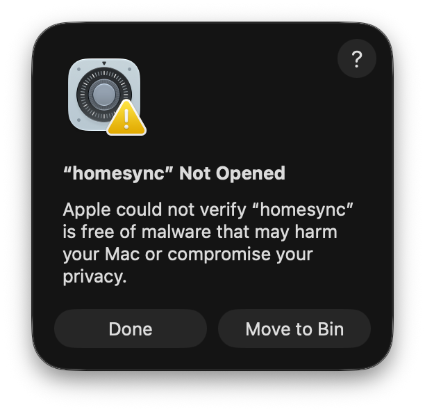

# homesync

Homesync is a TUI for managing [Homesick](https://github.com/technicalpickles/homesick), a tool for syncing your dotfiles between computers using a Git repository (called a castle in Homesick terms) for tracking history.

## What it does

It allows you to review your local changes, commit them, push them, see pending changes from origin, and pull them. It also handles linking files from the castle back to your $HOME directory, and dealing with any conflicts.

### Feature parity

* Homesync has support for the following Homesick commands: `pull`, `commit`, `push`, `link`, `list`, `status`, `diff` and `show_path`.

* It does not yet implement: `track`, `clone`, `generate`, `destroy`, `rc`, `open`, `exec` or `cd`.

* Homesync also runs basic validation of `.sh` and `.json` files, as those are common dotfile types, and this prevents broken config files from being inadvertently pushed/pulled to another device.

### Git config

Homesync shells out to your native Git binary for interacting with the castle repo, so any config you have in place for commit signing, SSH keys, and so on, should Just Work™.

## Installing

Download the latest archive for your platform from the [releases page](https://github.com/Rylon/homesync/releases/latest), extract it, then move the `homesync` onto your `$PATH`, for example on an Apple Silicon Mac:

```sh
tar -xzf homesync_*_darwin_arm64.tar.gz
sudo mv homesync /usr/local/bin/
homesync -version
```

Archives are published for macOS and Linux, on both `amd64` and `arm64` architectures.

> [!NOTE]
> Homesync is not currently notarised by Apple, so you will see a warning from macOS when you try to run it for the first time:
>
> 
>To fix this, you can remove the quarantine flag after installing, like so:
>
>    ```sh
>    xattr -d com.apple.quarantine /usr/local/bin/homesync
>    ```

You're also welcome to download the source and compile it for yourself, see the [Local development](#local-development) section below for how to do that.

### Automatic updates

Homesync automatically checks for updates on launch. When new versions are available, you'll be able to read the changelog and apply the update from within the app.

Note: automatic updates are disabled when building from source.

## Local development

You need [Homebrew](https://brew.sh), and Go 1.27.0 or newer:

```
brew install go
git clone https://github.com/Rylon/homesync.git
cd homesync
go build
./homesync
```

### Tests

The test suite builds a fake $HOME and fake castle to test the behaviour properly, you can run all the tests like so:

```sh
go test ./...
```

### Releasing

GoReleaser handles creating new GitHub Releases automatically when pushing a new version tag, like so:

```sh
git tag -a v0.0.1 -m "New release!"
git push origin v0.0.1
```

You can also perform a snapshot build locally, which will compile everything, and write to `./dist/` for you to inspect.

```sh
brew install goreleaser
goreleaser release --snapshot --clean
```

## Known issues

### iTerm2: alternate screen mode scrollback

If you use iTerm2, the default behaviour is to save lines from the alternate screen mode to your scrollback. With this setting enabled, the terminal fills with fragments of the interface after you resize the window and quit.

If you don't need this behaviour, you can disable it to fix this:

1. From the iTerm2 menu, choose `Settings` -> `Profiles` -> `Terminal`.
2. Clear the checkbox for `Save lines to scrollback in alternate screen mode`.

I also tested using Apple Terminal and Ghostty, but they did not have this issue.
